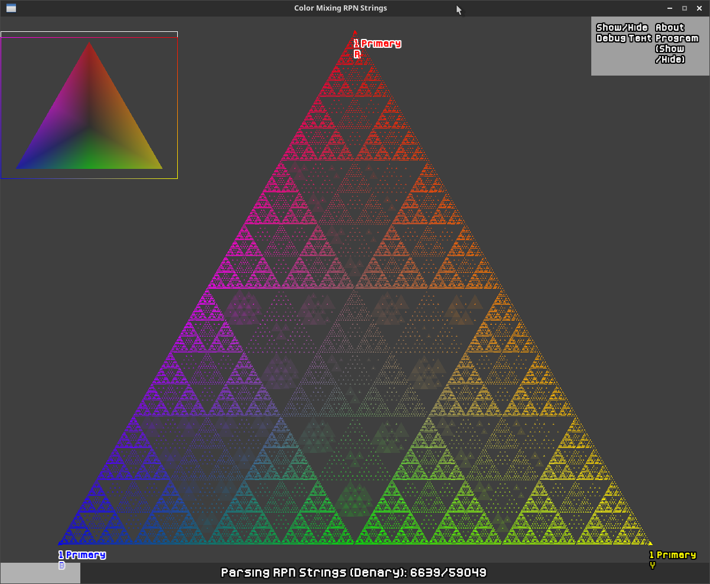
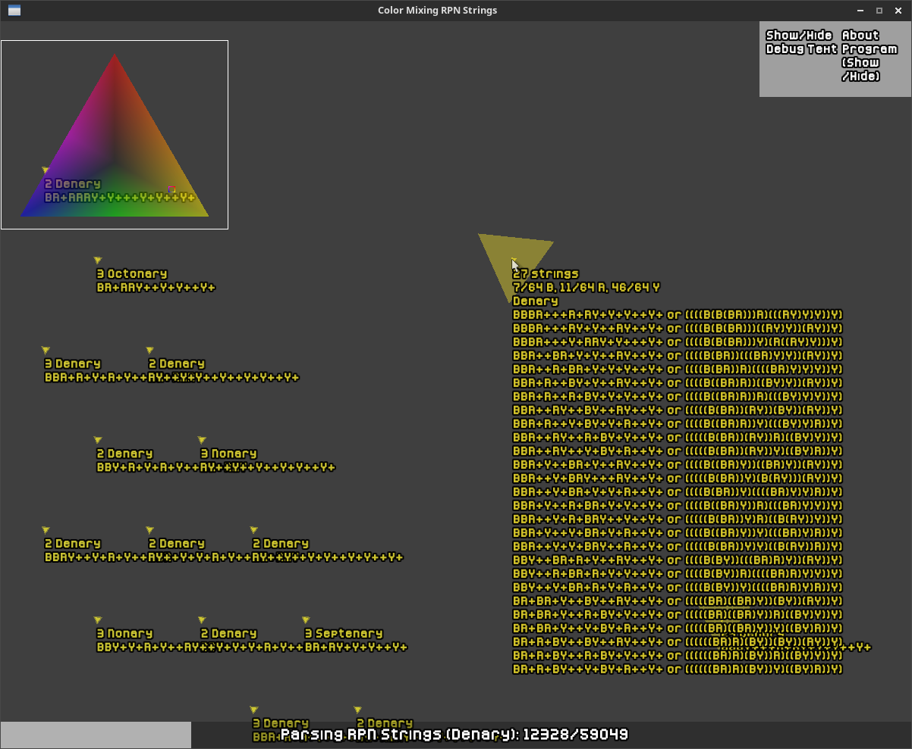

# color_mixing_rpn_strings
This program was inspired by Glowbes from My Singing Monsters.
From https://mysingingmonsters.fandom.com/wiki/Glowbes. I was inspired
by the math of the color combinations of Glowbes, that I have created a program
that creates Reverse Polish Notation (RPN), or Postfix strings of Blue, Red,
and Yellow glowbes to find different color combinations of Primary, Secondary, Tertiary,
all the way to Denary Glowbes (x10 Glowbe combinations).
Controls: W,A,S,D to move the camera up, left, down, and right. Q and E to zoom in/out.
Z and C to rotate the camera clockwise and counter-clockwise. Click on any rotated
triangle to see its color combination. You will have to zoom in on a triangle until it rotates.

Math:
The + operator is the midpoint of the vectors B[1,0,0], R[0,1,0], and Y[0,0,1].
The triangle vectors/points all lie on the plane b+r+y=1.
The string format is in RPN notation. Examples: BR+ is read as mix Blue and Red. BBR+BY+++ is
read as \"Mix Blue+Red, then Yellow+Blue, then mix Blue+Red with Blue+Yellow, and finally
mix Blue with the Blue+Red and Yellow+Blue combination\". More information of RPN at
https://mathworld.wolfram.com/ReversePolishNotation.html. Note that there is also
infix notation using parenthesis on the right of the RPN string.

Some interesting math properties of midpoints and the B/R/Y vectors is that
it is not associative. Example: (BR)Y =/= B(RY). It is commutative,
BY == YB and (BY)R == (YB)R == R(YB) == R(BY). Any same color combination can be
merged together or simplify. Example: (BB)R == BR, ((YB)(BY))(RY) == (YB)(RY).
The program uses multiset strings and dyck words to find all the color combinations.
It will only insert strings if the string does not merge together or simplify
and it will only insert if it is the lowest combination it can be for a triangle.
Example: If a triangle is only Tertiary, it will not add
any higher combinations of Quaternary, Quinary, Senary... etc. strings.
This program was made using SFML 2.5.1 and C++20 in Visual Studio Code (on Arch Linux).
Font used: Kenney Pixel.ttf by Kenney https://www.kenney.nl/"

# Images
Program creating the triangle and parsing strings. It creates creates a triangle similar to a Sierpiński triangle when using midpoints to combine colors only using Blue, Yellow, Red, and mixtures of Blue/Yellow/Red only.

Click on a rotated triangle to see more information. Such as the its Blue Red Yellow vector (Components sum up to 1) and its RPN or Infix notation on how to mix to get this vector. Some triangles can have more than one combination, where they point to the same Blue Red Yellow vector.

